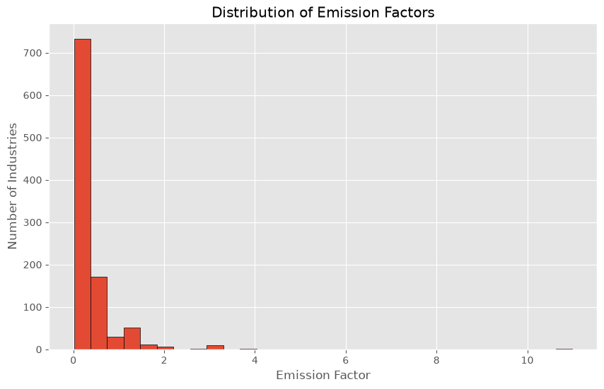
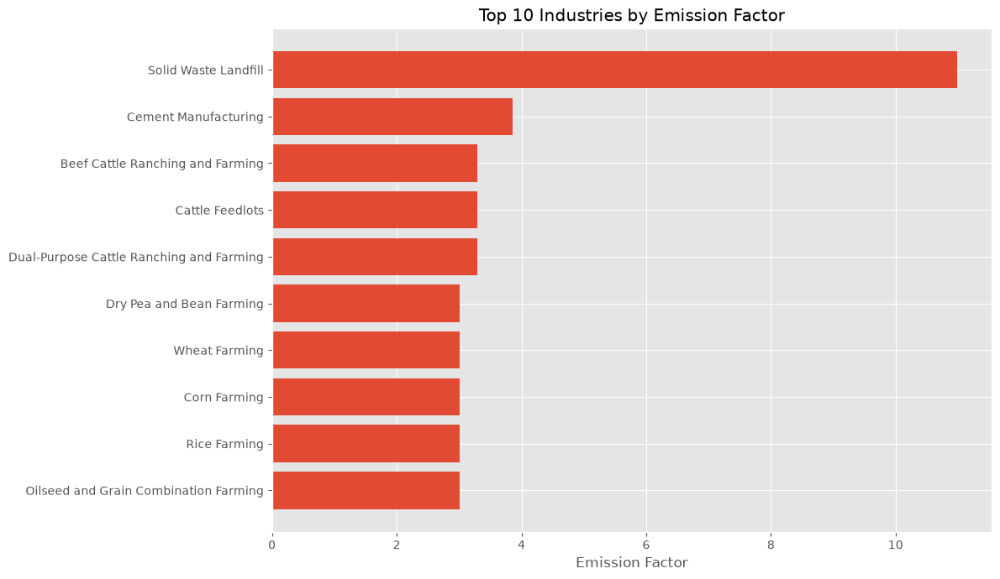
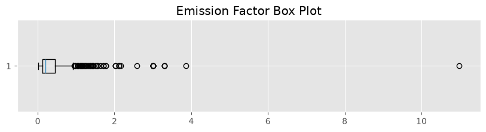

# *[SourceDB](https://www.kaggle.com/datasets/sahirmaharajj/supply-chain-greenhouse-gas-emission)*

# 🌍 Supply Chain Greenhouse Gas Emissions Analysis

An end-to-end data analytics project that explores greenhouse gas (GHG) emission factors across industries using SQL Server and Python.

The project demonstrates a complete analytics workflow, starting from raw data ingestion and transformation using a Medallion Architecture (Bronze → Silver → Gold), followed by exploratory data analysis (EDA) and business insights generation.

---

## 📌 Project Objectives

- Analyze greenhouse gas emission factors across industries.
- Identify the highest-emitting industries.
- Explore the distribution of emission factors.
- Detect significant outliers.
- Generate business recommendations to support sustainability initiatives.

---

# 📑 Table of Contents

- [Project Objectives](#-project-objectives)
- [Project Architecture](#-project-architecture)
- [Project Structure](#-project-structure)
- [Technologies Used](#-technologies-used)
- [Database Design](#-database-design)
- [SQL Pipeline](#-sql-pipeline)
- [Exploratory Data Analysis](#-exploratory-data-analysis)
- [Key Findings](#-key-findings)
- [Recommendations](#-recommendations)
- [Future Improvements](#-future-improvements)
- [How to Run](#-how-to-run)
- [Author](#-author)

---

## 🏗️ Project Architecture

```
Raw Dataset (CSV)
        │
        ▼
Bronze Layer (SQL Server)
        │
        ▼
Silver Layer
(Data Cleaning & Standardization)
        │
        ▼
Gold Layer
(Business Views)
        │
        ▼
Python (Pandas + Matplotlib)
        │
        ▼
EDA & Business Insights
```

---

## 📂 Project Structure

```
SupplyChainCarbonAnalysis/
│
├── notebooks/
│   └── EDA.ipynb
│
├── sql/
│   ├── bronze/
│   ├── silver/
│   └── gold/
│
├── images/
│
├── data/
│
├── pyproject.toml
├── uv.lock
└── README.md
```

---

## 🛠️ Technologies Used

- SQL Server
- T-SQL
- Python
- Pandas
- Matplotlib
- PyODBC
- Jupyter Notebook
- UV (Python package management)

---

# 🗄️ Database Design

The project follows a Medallion Architecture:

Bronze → Raw imported data

Silver → Cleaned and standardized dataset

Gold → Business-ready analytical views

Gold Views:

- vw_EmissionSummary
- vw_IndustryRanking
- vw_Contribution
- vw_EmissionCategories

---

# ⚙️ SQL Pipeline

The SQL workflow consists of:

1. Import raw CSV into SQL Server.
2. Build Bronze layer.
3. Clean and standardize data in Silver.
4. Create analytical Gold views.
5. Connect Python directly to SQL Server.
6. Perform exploratory data analysis.

The pipeline transforms raw data through three layers:

- **Bronze**: Raw CSV ingested as-is into `bronze.raw_emissions`.
- **Silver**: Data cleaned (standardized NAICS codes, trimmed names, handled nulls) into `silver.clean_emissions`.
- **Gold**: Aggregated and business-ready views created:
  - `vw_EmissionSummary` – overall statistics
  - `vw_IndustryRanking` – rank by emission factor
  - `vw_Contribution` – percentage contribution
  - `vw_EmissionCategories` – quartile-based categories

All SQL scripts are stored in `sql/` with a numbered execution order.

---

# 📊 Exploratory Data Analysis

The notebook includes:

- Data Overview
- Summary Statistics
- Missing Value Analysis
- Distribution Analysis
- Outlier Detection
- Top 10 Highest Emitting Industries
- Business Recommendations

Notebook:

📓 notebooks/EDA.ipynb

---

## 📊 Analytical Workflow

The analysis includes:

- Data quality assessment
- Summary statistics
- Distribution analysis
- Outlier detection
- Top emitting industries analysis
- Business recommendations

---

## 🔍 Key Findings

- The dataset contains **1,016 industries**.
- No missing values were found in the Gold layer.
- Emission factors exhibit a highly right-skewed distribution.
- A relatively small number of industries account for the highest emission factors.
- Solid Waste Landfill and Cement Manufacturing are among the highest-emitting industries.

---

## 💡 Recommendations

- Prioritize detailed assessments of the highest-emitting industries to identify emission reduction opportunities.
- Segment industries by emission level to support targeted sustainability strategies.
- Investigate high-emission outliers to better understand the operational factors driving emissions.
- Extend the analysis to broader NAICS sector groupings for higher-level strategic planning.
- Incorporate historical data to monitor long-term emission trends.

---

## 📈 Sample Visualizations

### Distribution of Emission Factors



**Insight**

The distribution is highly right-skewed, indicating that most industries have relatively low emission factors while a small number of industries exhibit substantially higher emissions.

**Business Impact**

Environmental initiatives should prioritize high-emission industries where reduction efforts are likely to produce the greatest impact.

---

### Top 10 Industries



**Insight**

A relatively small group of industries dominates the highest emission factors, led by Solid Waste Landfill and Cement Manufacturing.

**Recommendation**

Prioritize these industries for detailed operational assessments and targeted emission reduction strategies.

---

### Box Plot



**Insight**

Several industries appear as clear outliers, confirming that emission factors vary considerably across sectors.

**Recommendation**

Investigate these high-emission industries to understand the operational or sector-specific drivers behind their elevated emissions.

---

## 🚀 Future Improvements

- Interactive Tableau dashboard
- Streamlit web application
- Automated SQL pipeline
- dbt implementation
- Airflow orchestration
- Cloud deployment (Azure / GCP / AWS)

---
## ▶️ How to Run

### Prerequisites
- SQL Server (2022 or later) with SQL Server Management Studio (SSMS)
- Python 3.13 or later (via [uv](https://docs.astral.sh/uv/) or standard pip)
- Git

### 1. Clone the Repository
```bash
git clone https://github.com/4MaxR/SupplyChainCarbonAnalysis.git
cd SupplyChainCarbonAnalysis
```


## 👤 Author

**Mustafa Al Rouby**

- LinkedIn: *[Mustafa AlRouby](www.linkedin.com/in/mustafa-al-rouby-20218b171)*
- GitHub: *[4MaxR](https://github.com/4MaxR)*
- Portfolio: *[Website](https://mostafaalrouby.com/#home)*
